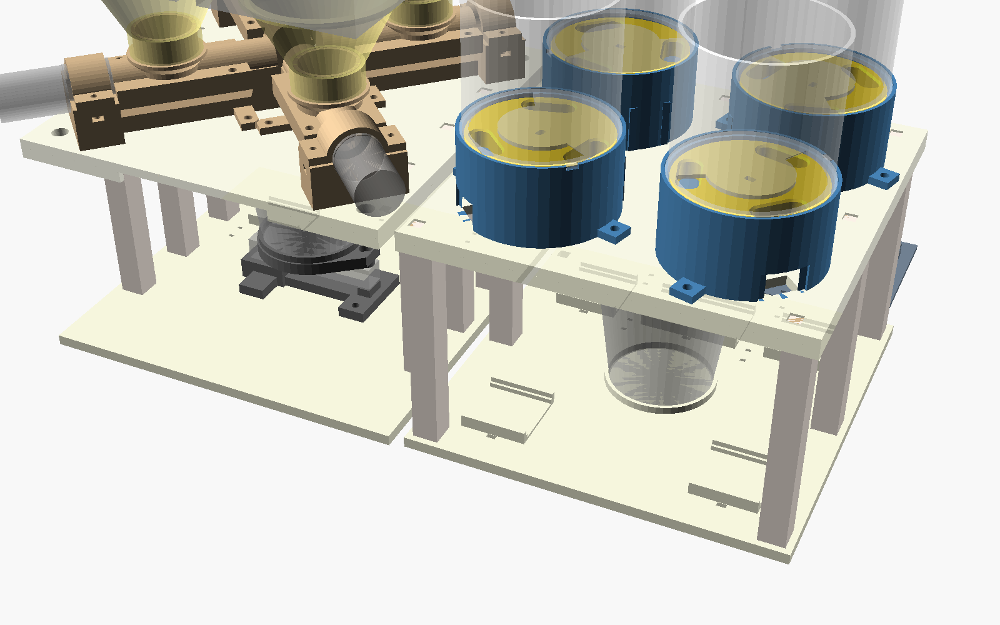
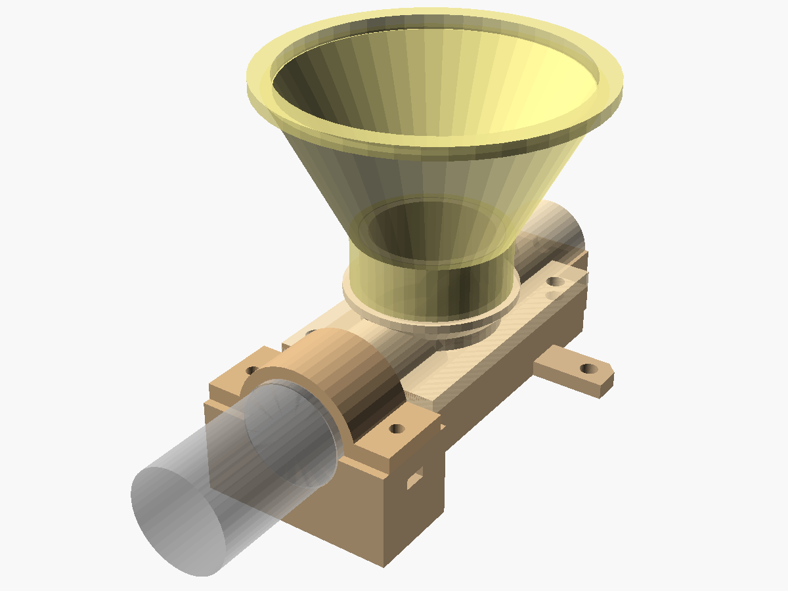
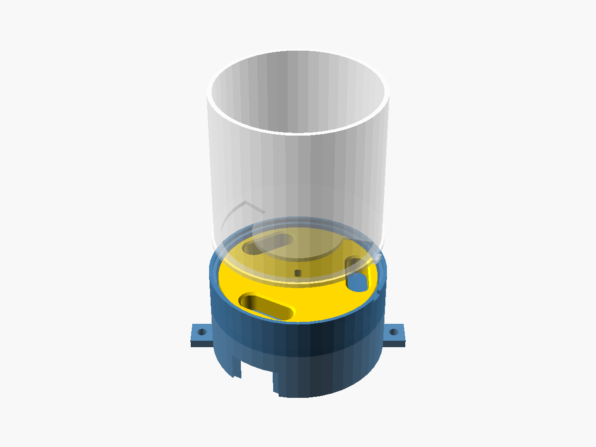

# stackdose

**버튼 한 번으로 내 보충제 조합(스택) 1회분을 컵에 담아 주는 디스펜서**

가루 4종과 알약·캡슐 4종을 넣어 두고, 웹에서 "운동 전", "운동 후" 같은 프리셋을 누르면 정해 둔 양만큼 담아 줍니다. 컵은 두 개로, 가루 컵은 가루 스테이션 저울 위에, 알약 컵은 알약 스테이션에 놓습니다. 가루는 저울로 무게를 재면서 목표량이 되면 멈추고, 알약은 원판이 돌면서 한 알씩 떨어뜨립니다.



> **진행 상황 (2026-09):** 3D 설계와 배선 설계를 마쳤고, 부품을 주문하는 단계입니다. 아직 실물로 만들어 보지 않았습니다. 다음은 웹(백엔드 + 가상 디스펜서)입니다.

## 기능

- **프리셋 3개 이상:** 사용자 설정 1·2·3…마다 가루 몇 g, 알약 몇 알을 저장
- **가루 4칸:** 스크류(오거)가 가루를 밀어내고, 컵 밑 로드셀로 무게를 보면서 목표 g에서 멈춤 (폐루프)
- **알약 4칸:** 칸이 3개인 원판이 120°씩 돌아 한 알씩 배출. 자석 + 홀 센서로 원점을 찾음
- **웹 먼저:** 하드웨어가 없어도 가상 디스펜서로 전체 흐름을 돌려 볼 수 있게 만들 예정

## 구조

| 가루 모듈 | 알약 모듈 |
|---|---|
|  |  |
| JGA25-370 DC 모터 + 3D 프린트 스크류. 네 모듈이 컵 위에서 X자로 모임 | 28BYJ-48 스텝 모터 + 칸 3개 원판. 출구 아래 미끄럼관이 컵으로 이어짐 |

```
웹 (프리셋 선택) ──HTTP──▶ ESP32 ─┬─ DRV8833 ×2 ── 가루 모터 ×4
                                 ├─ MCP23017 (I2C) ── ULN2003 ×4 ── 알약 모터 ×4
                                 ├─ HX711 ── 로드셀 1kg (컵 무게)
                                 └─ 홀 센서 ×4 (알약 원판 원점)
```

## 폴더

| 폴더 | 내용 |
|---|---|
| [hardware/cad](hardware/cad) | OpenSCAD 설계 (치수는 `config.scad` 한 곳), 출력용 STL, 자동 검사 스크립트 |
| [hardware/wiring.md](hardware/wiring.md) | 전원, ESP32 핀 배정, 선 길이 |
| [hardware/parts.md](hardware/parts.md) | 부품표 |
| `backend/` · `frontend/` · `firmware/` | 예정 |

## 설계 원칙

- **서포트 없이 출력:** 모든 부품이 Ender-3 SE(220×220mm)에 서포트 없이 들어가도록 방향과 모양을 잡았습니다.
- **나사 20개:** 힘을 받는 곳(모터, 로드셀)에만 나사를 쓰고, 나머지는 핀·돌기·턱으로 끼우거나 한 덩어리로 출력합니다.
- **검사하고 출력:** `python hardware/cad/check.py`가 부품 렌더 오류, 출력판 크기, 떨어진 조각, 조립 상태의 부품 겹침(155쌍), 컵을 꺼내는 길, 알약 원판의 대기 위치를 검사합니다. `overhang.py`는 서포트가 필요한 면을 찾습니다.
- **공차는 쿠폰으로:** 프린터마다 다른 끼워 맞춤 여유를 공차 쿠폰 하나로 재서 `config.scad`에 넣습니다.

## 로드맵

- [x] 3D 설계 · 자동 검사
- [x] 배선 설계 · 부품 선정
- [ ] 백엔드: FastAPI + SQLite (프리셋, 배출 기록)
- [ ] 프론트엔드: 프리셋 화면 + 가상 디스펜서
- [ ] 펌웨어: ESP32 (무게 폐루프 배출, 원점 찾기)
- [ ] 출력 · 조립 · 실측값 반영
